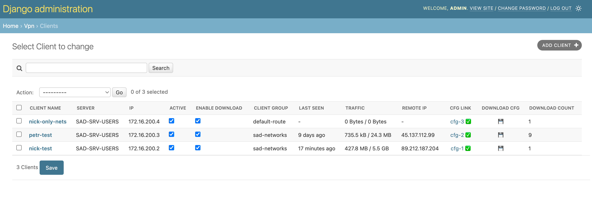

**Light VPN clients manager helper for WireGuard (via Django admin interface)**

- Simple setup
- Can work with many servers (via SSH, include localhost)
- Share VPN configs
- Show simple clients statistic

Setup:
- install this repo on any server
- install wireguard to the same or another server (Debian based recommendation)
- copy ssh key (see help hint on server after add)
- add clients
- share config link with friends
- that's all !

